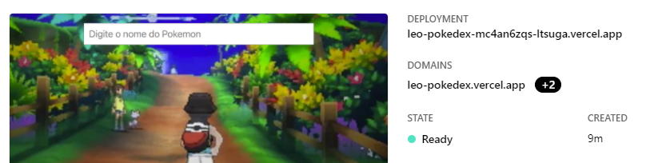

# Pokedex & PokeAPI

## Simple Pokedex app. Enter pokemon name in input box and it will retrieve data from pokeAPI (https://pokeapi.co/).

<h4 align="center"> 
	Running on Vercel server: https://vercel.com/ltsuga/leo-pokedex
</h4>

<h1 align="center">
  
</h1>

### 🛠 Created with React

- [React](https://pt-br.reactjs.org/)
